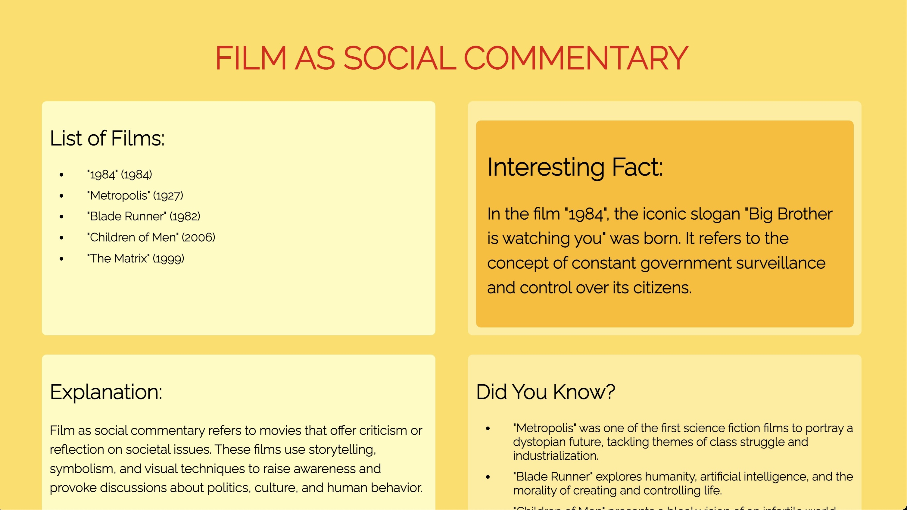
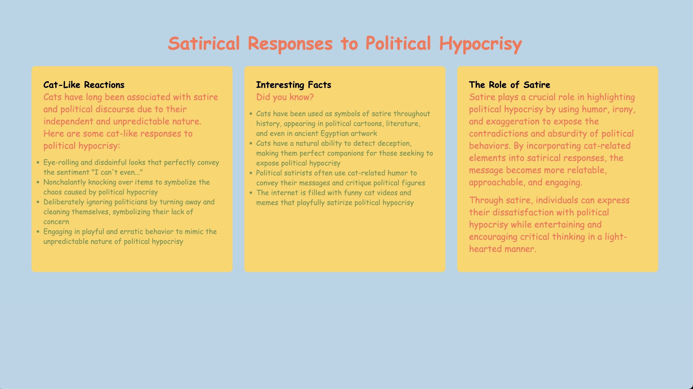

# website-generator

In meinem Projekt geht es darum, Webseiten mit ChatGPT zu generieren. Bei jedem Website Refresh wird eine von ChatGPT generierte Website angezeigt, gestaltet und gefüllt mit Inhalten von ChatGPT.

Leider konnte ich das Projekt kostenlos nicht deployen, weil der API Request zu lange dauert. Hier der Link zu der nicht funktionierenden Seite: https://website-generator-green.vercel.app

Man kann das Projekt lokal laufen lassen und mit einem eignen API-Key ausprobieren.

Ich will das Projekt weiterentwickeln. Ganz wichtig ist neben einem erfolgreichen deployen eine Ladeanimation, um Besucher:innen zu signalisieren, dass sie noch ein bisschen warten müssen. Das generieren jeder Seite dauert ca 10-20 Sekunden. Ich will auch weiter an den Prompts arbeiten. Ich habe mich sehr lange mit den Prompts beschäftigt und würde das gerne weiter verfeinern und sehen, was noch alles möglich ist.

